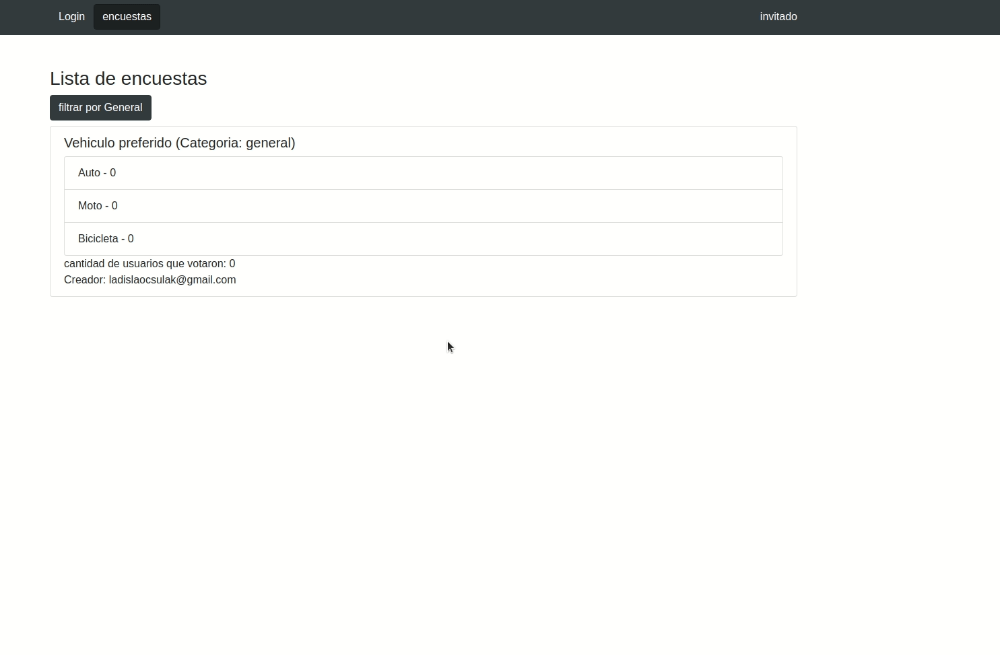

# Encuestas React-Web

### Demo - user invitado

### Demo - user autor

### Demo - user admin

# Contenido:

- [Intro](#intro)
- [Host by Firebase](#host-by-firebase)
- [Librerias y Frameworks](#librerias-y-frameworks)
- [Correr Proyecto](#correr-proyecto)

## Intro
Proyecto realizado para aprender los fundamentos de React Js.
Login (control de acceso), persistencia de informacion y Host desarrollado en *Firebase*.

Topicos abordados: Components, Hooks, Router, userState, useEffect, useSelector, API Context, Redux, Axios, rutas protegidas, Firebase Login y Reglas(Firestore Rules), Firestore DB, Firebase Host 

## Host by Firebase

[Encuestas Web](https://encuestas-web-20883.web.app/)

## Librerias y Frameworks
Tener en cuenta que para el desarrollo del proyecto se instalaron las siguientes librerias y frameworks

- npm i redux

- npm i react-redux

- npm i redux-devtools

- npm i redux-thunk

- npm i axios

- npm install react-router-dom

- npm i firebase

## Correr Proyecto

Se debe tener instalado node

- clonar proyecto
- npm i
- npm run start

- Puerto default 3000